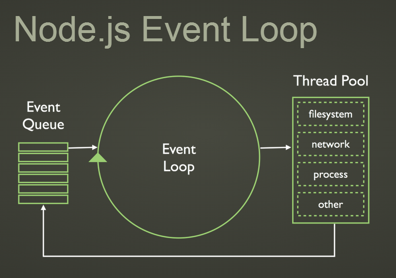

{{ The default Mustache delimeters clash with remark :-( }}
{{=[[ ]]=}}

name: inverse
layout: true
class: center, middle, inverse
---
#An Introduction to .green[Node.js]

.footnote[
	[nodejs.org - project site](http://nodejs.org/)
]

---
layout: false
.left-column[
  ## Overview
]
.right-column[

- What is Node.js?


- What is all the fuss about?


- How to get started


- The Event Loop


- Developing JavaScript for Browser with Node.js
]

---
template: inverse

#What is .green[Node.js]?

---
layout: false

.left-column[
  ## What is Node.js?
]
.right-column[
- A cross-platform runtime environment for server-side and networking applications written in JavaScript
]

--
.right-column[
- Built on [V8](https://code.google.com/p/v8/), Chrome's JavaScript interpreter/runtime


- Extends V8 to provide server APIs (Filesystem, Network Sockets)
]

--
.right-column[
- Tools - **npm** for accessing the module registry http://registry.npmjs.org/
]

--
.right-column[

- Open source with a large community
]

---
template: inverse

#What is all the .green[Fuss] about?

---

layout: false
  ## What is all the fuss about?

.left-column[

  ### .green[JavaScript]
]

--
.right-column[
- Cross-platform
  - Browser
  - Server (Windows, OSX, *nix)
  - Mobile (Browser)
]
--
.right-column[
- Browser devs have one less barrier to the server-side 
]
--
.right-column[
- Server-side devs have familiar runtime for learning JavaScript
]

---
  ## What is all the fuss about?
.left-column[

  ### .green[The Event Loop]
]

.right-column[
- Applications are single threaded
]

--

.right-column[
- IO is event-driven and non-blocking
]

--
.right-column[
> Node.js applications reduce the time spent waiting on IO
]
---
template: inverse

#Getting Started

---

- ##Install Node.js

--

- ##Create

[[#code-snippet]]{
	"src": "examples/simple-app/main.js",
	"terminal": { "name": "simple-app" }
}[[/code-snippet]]

--

- ##Run

```shell
node main
```

---
#Building .green[real] Node.js Applications

--

- ##Modular design

--

- ##Third party dependencies

--
- ##Build lifecycle - Build, Test, Deploy, Publish etc


---
#An example - .green[jira-client]

- Both a Node.js module and CLI app to retrieve the summary for a Jira issue

--

- Use Jira's Rest API

--

- Module - `require('jira-client')`

```javascript
var JiraClient = require('jira-client');

var jiraClient = new JiraClient(config /*user:, password: */);

jiraClient.getIssue(key, function (err, issue) {
  if (err) ...
  console.log(issue);
});

```

--
- CLI - `jira-issue <KEY>`

```bash
> jira-issue JI-123

JI-123: jira-issue should do something
```
---
#package.json

Used by node and npm (and other tools) to build, test, publish etc

[[#code-snippet]]{
    "src": "examples/jira-issue/package.json"
}[[/code-snippet]]

---
name: main
#The Main Module

---
template: main
[[#code-snippet]]{
    "src": "examples/jira-issue/index.js",
    "lines": [1, 11]
}[[/code-snippet]]

---
template: main
[[#code-snippet]]{
    "src": "examples/jira-issue/index.js",
    "lines": [13]
}[[/code-snippet]]

---
#The CLI Script

[[#code-snippet]]{
    "src": "examples/jira-issue/bin/cli.js"
}[[/code-snippet]]

---
# Build Lifecycle

.left-column[
  ### Build
]

.right-column[

```
npm install
```

[[#code-snippet]]{
    "src": "examples/jira-issue/package.json",
     "terminal": { "name": "jira-issue" },
    "lines": [10]
}[[/code-snippet]]
]

---
# Build Lifecycle

.left-column[
  ### Test
]

.right-column[

```
npm test
```

[[#code-snippet]]{
    "src": "examples/jira-issue/package.json",
     "terminal": { "name": "jira-issue" },
    "lines": [6,8]
}[[/code-snippet]]
]

---
# Build Lifecycle

.left-column[
  ### Test
]

.right-column[

[[#code-snippet]]{
    "src": "examples/jira-issue/test/JiraClientSpec.js",
     "terminal": { "name": "jira-issue" },
    "lines": [1,22]
}[[/code-snippet]]
]

---
# Build Lifecycle

.left-column[
  ### Test
]

.right-column[

[[#code-snippet]]{
    "src": "examples/jira-issue/test/JiraClientSpec.js",
     "terminal": { "name": "jira-issue" },
    "lines": [25]
}[[/code-snippet]]
]

---
.add-terminal[{
  "cwd": "examples/jira-issue"
}]

# Build Lifecycle

.left-column[
  ### Publish to NPM
]

.right-column[

```
npm publish
```
]
---
.add-terminal[{
  "cwd": "examples/jira-issue"
}]

# Install Globally

```
npm install -g jira-issue
```

--

[[#code-snippet]]{
    "src": "examples/jira-issue/package.json",
     "terminal": { "name": "jira-issue" },
    "lines": [9,9]
}[[/code-snippet]]

---
template: inverse
#The .green[Event Loop]

---
#.red[The Problem]

--
- ###Our applications have to deal with many concurrent and long lived connections

--

- ###We ~~don't want to~~ can't manage multiple threads

--

- ###Most of the time server are waiting on IO (hitting the datastore)

---
#.green[The Solution]

- ###A Single-threaded programming model with evented non-blocking IO 

--

- ###An implementation of the Reactor Pattern

--

#?


---
template: inverse


---
>With the .green[Event Loop] we do not have to worry about orchestrating concurrent processess and we can focus on implementing what our applications actually do

---
#The Event Loop in Action

[[#code-snippet]]{
	"src": "examples/eventLoop/event-loop.js",
	"terminal": true
}[[/code-snippet]]


---
#A non-blocking web server
[[#code-snippet]]{
    "src": "examples/async-io/server.js",
    "lines": [1, 9]
}[[/code-snippet]]

---
#A Non-blocking web server
[[#code-snippet]]{
    "src": "examples/async-io/server.js",
    "lines": [10, 27]
}[[/code-snippet]]

---
#A Non-blocking web server
[[#code-snippet]]{
    "src": "examples/async-io/server.js",
    "lines": [28]
}[[/code-snippet]]


---
template: inverse

#What about my other cores?

---

#The .green[Cluster] module - Poor person's load balancing

--

[[#code-snippet]]{
    "src": "examples/async-io/cluster.js",
    "lines": [1, 10]
}[[/code-snippet]]

--
[[#code-snippet]]{
    "src": "examples/async-io/server.js",
    "lines": [37]
}[[/code-snippet]]

---
template: inverse

#Back to the Browser

--

##.green[This Slideshow!]

---
#package.json

[[#code-snippet]]{
	"src": "package.json",
	"lines": [1,21]
}[[/code-snippet]]

---
#package.json

Building, Testing (?!), and Starting the Server

[[#code-snippet]]{
	"src": "package.json",
	"lines": [22]
}[[/code-snippet]]

---
#The Server

[[#code-snippet]]{
	"src": "server.js",
	"terminal": true,
	"lines": [1, 14]
}[[/code-snippet]]

---
#The Server

[[#code-snippet]]{
	"src": "server.js",
	"terminal": true,
	"lines": [16, 39]
}[[/code-snippet]]

---
#The Browser

[[#code-snippet]]{
	"src": "src/browser/main.js",
	"terminal": true,
	"lines": [1, 24]
}[[/code-snippet]]


---
#The Browser

[[#code-snippet]]{
	"src": "src/browser/main.js",
	"terminal": true,
	"lines": [26, 45]
}[[/code-snippet]]

---
#Browserify


.footnote[
Browserify http://browserify.org/
]
--


Transform Node.js modules to JavaScript (slides.js) for Browser

--
- Use the CommonJS module system (`module.exports`, `require()`)

--

- Get `require()` in the Browser

--

# .green[Resuse] in Server and Browser!
---
#Starting the Server

[[#code-snippet]]{
  "src": "package.json",
  "lines": [31, 40]
}[[/code-snippet]]

Build & Run
```bash
npm run build

npm start [-p PORT] [--shell SHELL_CMD]
```

---
template: inverse
#.green[Thank you]

.footnote[

https://github.com/PeterHancock/node-js-intro


remark.js https://github.com/gnab/remark

remark code snippets https://github.com/PeterHancock/remark-code-snippets
]